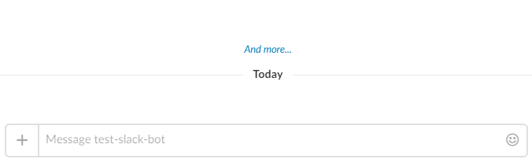

go-slack-reporting
==================

[](https://travis-ci.org/itglobal/go-slack-reporting)
[](LICENSE)
[](https://godoc.org/github.com/itglobal/go-slack-reporting)

Small utility library to report last state of any long-running process to Slack.



Installing
----------

```shell
go get -u github.com/itglobal/go-slack-reporting
```

Usage
-----

First you should initialize a configuration and create a reporter object:

```golang
import (
    slrep "github.com/itglobal/go-slack-reporting"
)

func foobar() {
    // ...
    config := slrep.NewConfig("MY_ACCESS_TOKEN")            // REQUIRED: set Slack access token
    config.SetChannel("#channel")                           // REQUIRED: set Slack channel of username

    config.SetLogger(log.New(os.Stderr, "", log.LstdFlags)) // OPTIONAL: set logger for diagnostic messages
    config.SetUsername("Test bot")                          // OPTIONAL: override bot username
    config.SetIcon(slrep.NewIconFromEmoji(":smile:"))       // OPTIONAL: overide bot icon (from an emoji)
    config.SetIcon(slrep.NewIconFromURL("ICON_URL"))        // OPTIONAL: overide bot icon (from an image)

    reporter, err := config.CreateReporter()                // Create a reporter
    // ...
}
```

After that you may post a new message with initial status text:

```golang
msg, err := reporter.BeginMessage("Inital message text")
```

This will post a message into Slack. This message can be updated:

```golang
msg.Update("Updated status text")
```

Once message is not needed anymore, it may be deleted:

```golang
msg.Delete()
```

> Please note that you can use any ordinary Slack markup within both initial and updated statuses.

License
-------

This project is licensed under [MIT License](LICENSE).
